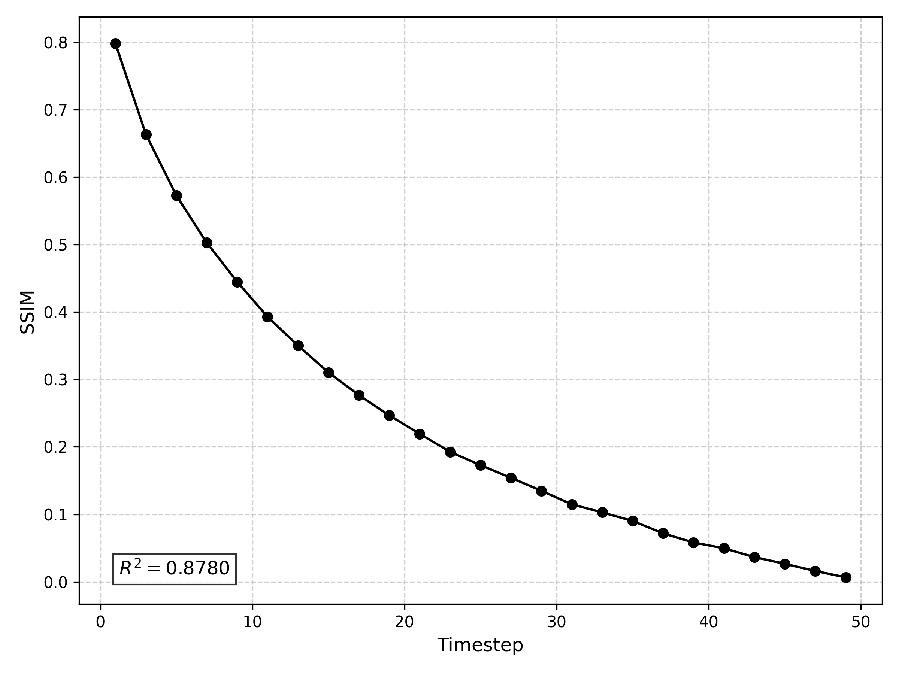
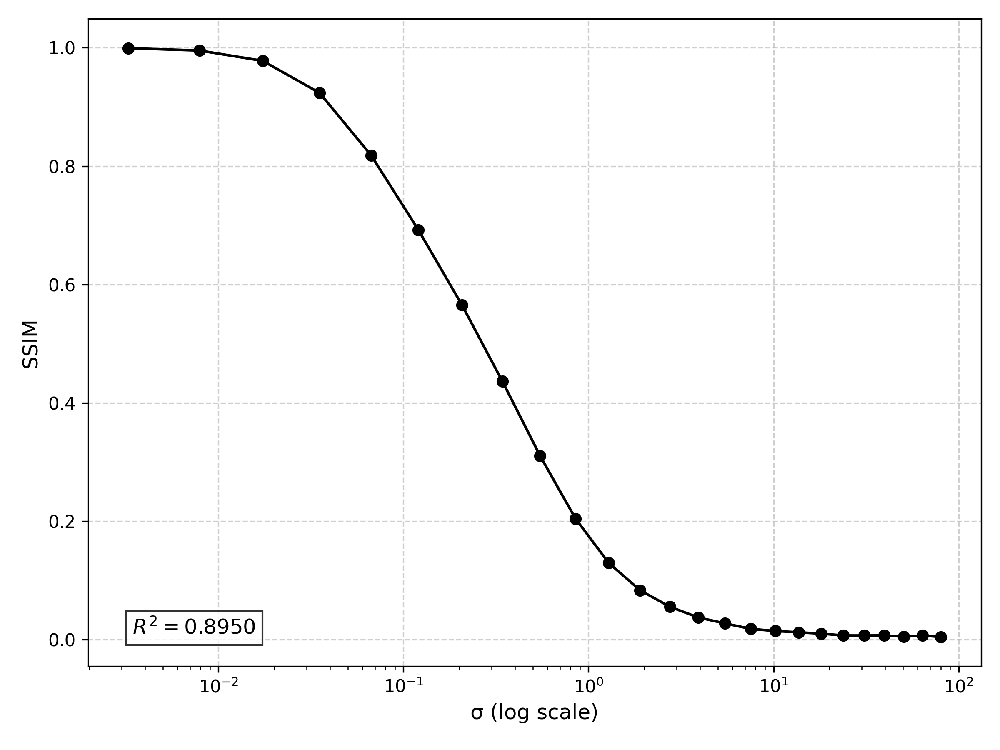
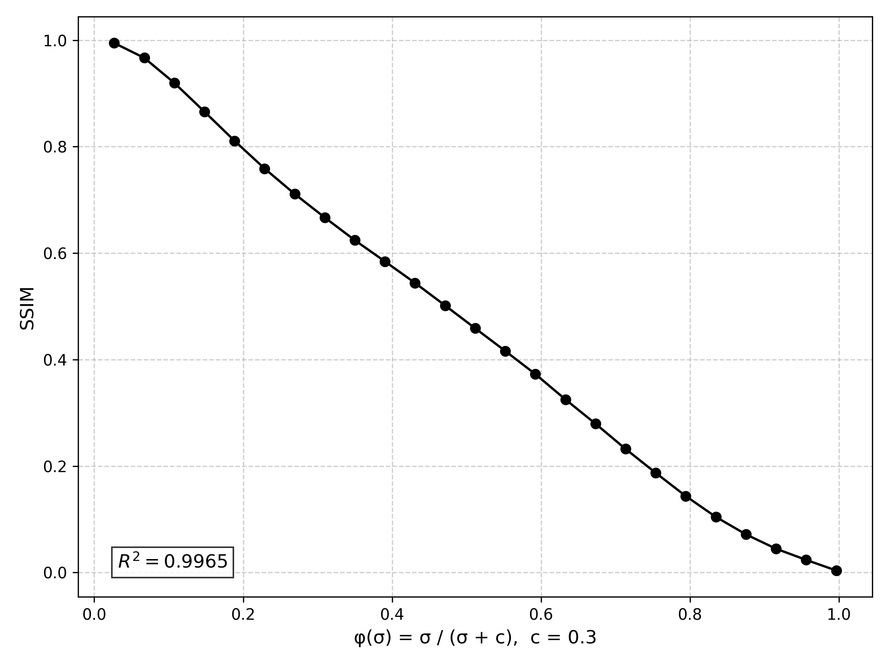

# SSIMBaD: Sigma Scaling with SSIM-Guided Balanced Diffusion for AnimeFace Colorization

> Official PyTorch implementation of
> **"Sigma Scaling with SSIM-Guided Balanced Diffusion for AnimeFace Colorization"**


## 1. Overview

**SSIMBaD** introduces a novel diffusion-based framework for automatic colorization of anime-style facial sketches. Unlike prior DDPM/EDM-based methods that rely on handcrafted or fixed noise schedules, SSIMBaD leverages a perceptual noise schedule grounded in **SSIM-aligned sigma-space scaling**. This design enforces **uniform perceptual degradation** throughout the diffusion process, improving both **structural fidelity** and **stylistic accuracy** in the generated outputs.

This repository includes:

* 🧠 Pretraining with classifier-free guidance and structural reconstruction loss
* 🎯 Finetuning with perceptual objectives and SSIM-guided trajectory refinement
* 📈 Perceptual noise schedule design based on SSIM-\$\phi(\sigma)\$ curve fitting
* 🧪 Full evaluation pipeline for same-reference and cross-reference scenarios
---

## 2. Key Idea

The quality of diffusion-based generation is highly sensitive to how noise levels are scheduled over time.

Existing models like DDPM and EDM use different schedules for training and inference (e.g., log(σ) vs. σ<sup>1/ρ</sup>), often leading to **perceptual mismatches** that degrade visual consistency.

To resolve this, we introduce a shared transformation ϕ: ℝ<sub>+</sub> → ℝ used **consistently** in both training and generation.  
This transformation maps the raw noise scale σ to a perceptual difficulty axis, allowing uniform degradation in image quality over time.

We select the optimal transformation ϕ\* by maximizing the linearity of SSIM degradation over a candidate set Φ:

<div align="center">
  
</div>

This function achieves the best perceptual alignment, leading to **smooth and balanced degradation curves**.

> 🧞‍♂️ Think of ϕ\*(σ) as a perceptual "magic carpet ride" — smooth, stable, and optimally guided by structural similarity.

---

## 3. Folder Overview

```
├── pretrain.py                 # SSIMBaD training (EDM + φ*(σ))
├── finetune.py                 # Trajectory refinement stage
├── AnimeDiffusion_pretrain.py # Baseline reproduction (vanilla EDM schedule)
├── AnimeDiffusion_finetune.py # Baseline finetuning (MSE-based)
├── evaluate_*.py              # FID / PSNR / SSIM evaluation
├── optimal_phi.py             # φ*(σ) search via SSIM R² maximization
├── models/                    # Diffusion & U-Net architectures
├── utils/                     # XDoG, TPS warp, logger, path utils
└── requirements.txt
```
---

## 4. Noise Schedule Analysis

We visualize how SSIM degrades across diffusion timesteps for various noise schedules:

### SSIM Degradation Curves

| DDPM                            | EDM                            | SSIMBaD                        |
| ------------------------------- | ------------------------------ | ------------------------------ |
|  |  |  |

### Corresponding Noisy Image Grids

| DDPM                                  | EDM                                  | SSIMBaD                              |
| ------------------------------------- | ------------------------------------ | ------------------------------------ |
|  |  |  |


---

## 5. Installation

```bash
conda create -n ssimbad python=3.9
conda activate ssimbad
pip install -r requirements.txt
```

---

## 6. Dataset

* Dataset: **Danbooru Anime Face Dataset**
* Each sample = (`Igt`, `Isketch`, `Iref`)
* Sketch: Generated with XDoG filter
* Reference: TPS + rotation warped version of ground truth

**Prepare like:**

```bash
data/
├── train/
│   ├── 0001_gt.png
│   ├── 0001_sketch.png
│   └── 0001_ref.png
├── val/
...
```

---

## 7. Training SSIMBaD

```bash
python pretrain.py \
  --do_train 1
```

*This uses φ\*(σ) = σ / (σ + 0.3)* for both noise sampling and embedding.
Check `optimal_phi.py` to search the best φ empirically.

---

## 8. Trajectory Refinement

```bash
python finetune.py \
  --do_train 1
```

This is NOT a generic MSE finetuning like AnimeDiffusion.
It optimizes the **reverse trajectory** using perceptual noise scaling.

---

## 9. Baselines

* **AnimeDiffusion (vanilla EDM):**

```bash
python AnimeDiffusion_pretrain.py
```

* **Finetune AnimeDiffusion:**

```bash
python AnimeDiffusion_finetune.py
```

---

## 10. Evaluation

* **FID**:

```bash
python evaluate_FID.py \
  --pred_dir ./results/ \
  --gt_dir ./data/val/
```

* **PSNR + SSIM**:

```bash
python evaluate_SSIM_PSNR.py
```

---
